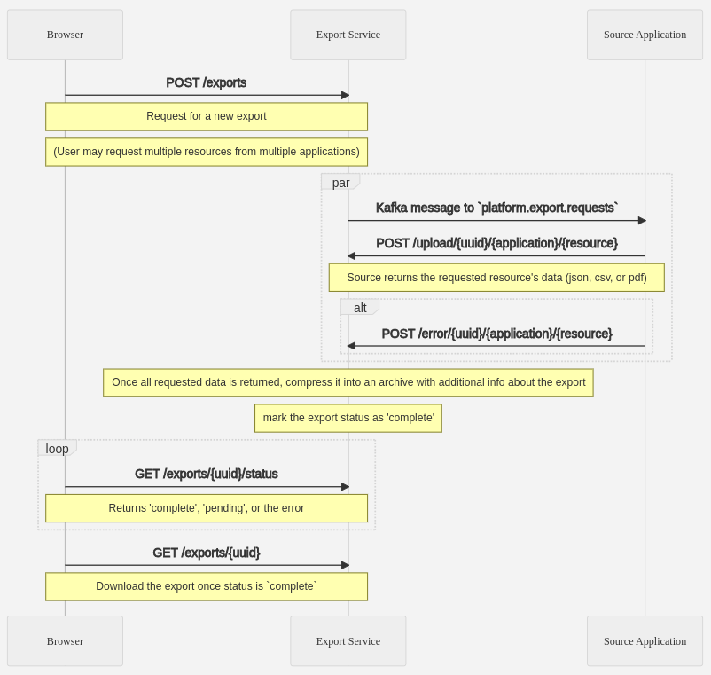

# Integrating with the export service
The basic process of using the export service is as follows:

*Examples of these requests can be found in the [Makefile](../Makefile).*
## For data sources (Internal API)

In order for your service act as an **source application** for the **export service** as shown above, your service must consume events from the `platform.export.requests` topic. The **export service** will send a Kafka message to this topic when a new export request is created. This message conforms to a [cloud-event schema](https://github.com/RedHatInsights/event-schemas-go) and will contain the following information:

- `id`: Unique UUID for this kafka message.
- `source`: The source of the event. In this case, it's `urn:redhat:source:console:app:export-service`.
- `subject`: Subject of the event. This contains the **export UUID** that is required to respond to the request. Formatting as following: `urn:redhat:subject:export-service:request:{uuid}`.
- `specversion`: Version of the CloudEvents specification this message adheres to.
- `type`: The type of event. This describes the nature of the event.
- `time`: The time at which the event was emitted. This is a timestamp in ISO 8601 format.
- `redhatorgid`: The Red Hat organization ID.
- `dataschema`: The URL of the schema that the event data adheres to. (`https://console.redhat.com/api/schemas/apps/export-service/v1/export-request.json`)
- `data`: The event data. This contains the following fields:
  - `uuid`: The unique **resource UUID**.
  - `application`: **Application name** a request is being made for. This is the name of the requested application.
  - `format`: This can be either `json` or `csv`. Note that `pdf` is not supported yet.
  - `resource`: Name of the requested resource.
  - `x-rh-identity`: Base64 encoded ID header.
  - `filters*`: Application-specific, schemaless JSON object used for filtering the data to be exported. This field is *not required*.

The **source application** is responsible for the consumption from the kafka topic, interaction with the application datastores, formatting the data, and posting the data to the export service API. (auth via pre-shared key)

The **source application** can return the requested export data to the `POST /app/export/v1/upload/{exportUUID}/{applicationName}/{resourceUUID}` internal endpoint. If any errors occur while processing the request, your service should instead send a POST request to the `POST /app/export/v1/error/{exportUUID}/{applicationName}/{resourceUUID}` internal endpoint with the error details, as shown in [this example](../example_export_error.json).

## For the browser front-end (Customer-Facing API)

For allowing users to request and download these exports, the following steps are required in the **browser**:

- The user must be logged in, so that the appropriate `x-rh-identity` header is present in their request, (for service-to-service requests, authentication with a pre-shared key is also available).
- The user-interface should allow the users to create new export requests, poll to see if the export is ready, and finally download the export when it is ready. The user-interface should also allow the user to delete completed exports via the `DELETE /exports/{uuid}` endpoint.

The body of the request to the `POST /exports` endpoint is outlined in [this example export](../example_export_request.json) should contain the following information:

- `name`: a human-readable name for the export request
- `format`: the format the export should be in. `"json"` or `"csv"` (`"pdf"` is not supported yet)
- `expires_at`: the date the export should expire. This is **not required**, and defaults to 7 days after the request is made.
- `sources`: an array of objects containing the following information:
  - `application`: identifier for the application/service a request is being made for
  - `resource`: string identifier for the resource a request is being made for
  - `expires`: the date the export should expire. This is optional, and defaults to 7 days after the request is made.
  - `filters`: application-specific, schemaless `json` object used for filtering the data to be exported. This is **not required**.

## Additional requirements
To request that we add the required network policies and PSK needed for your service to communicate with the internal API, please reach out to *@crc-pipeline-team*, message the *team-consoledot-pipeline* channel, or email *platform-pipeline@redhat.com*.
